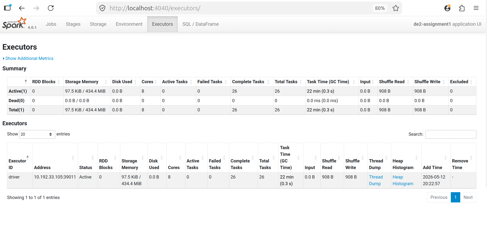
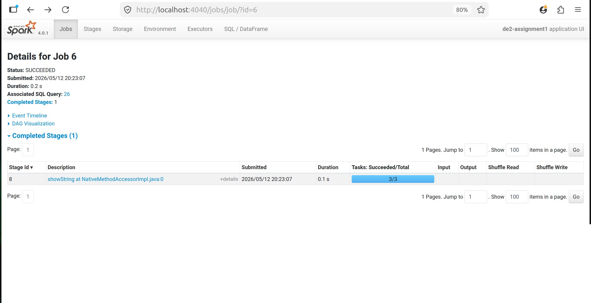

# lab1 assignment - Preuves

Captures et plans d'execution generes lors du lab.

## Captures d'ecran

### Executors



### jobs



## Plans et logs

### plan_baseline.txt

```text
PLAN DE REQUÊTE DE BASE
================================================================================
== Physical Plan ==
* ColumnarToRow (2)
+- Scan parquet  (1)


(1) Scan parquet 
Output [7]: [window_start#279, window_end#280, event_type#281, repo_name#282, event_count#283L, unique_actors#284L, public_events#285L]
Batched: true
Location: InMemoryFileIndex [file:/home/sable/Documents/E4FD/S4/Data Engineering/Data Engineering 2/lab1 assignment/outputs/lab1/stream_sink_baseline]
ReadSchema: struct<window_start:timestamp,window_end:timestamp,event_type:string,repo_name:string,event_count:bigint,unique_actors:bigint,public_events:bigint>

(2) ColumnarToRow [codegen id : 1]
Input [7]: [window_start#279, window_end#280, event_type#281, repo_name#282, event_count#283L, unique_actors#284L, public_events#285L]


```

### plan_optimized.txt

```text
PLAN DE REQUÊTE OPTIMISÉE (avec repartitionnement)
================================================================================
== Physical Plan ==
* ColumnarToRow (2)
+- Scan parquet  (1)


(1) Scan parquet 
Output [7]: [window_start#349, window_end#350, event_type#351, repo_name#352, event_count#353L, unique_actors#354L, public_events#355L]
Batched: true
Location: InMemoryFileIndex [file:/home/sable/Documents/E4FD/S4/Data Engineering/Data Engineering 2/lab1 assignment/outputs/lab1/stream_sink_optimized]
ReadSchema: struct<window_start:timestamp,window_end:timestamp,event_type:string,repo_name:string,event_count:bigint,unique_actors:bigint,public_events:bigint>

(2) ColumnarToRow [codegen id : 1]
Input [7]: [window_start#349, window_end#350, event_type#351, repo_name#352, event_count#353L, unique_actors#354L, public_events#355L]


```

