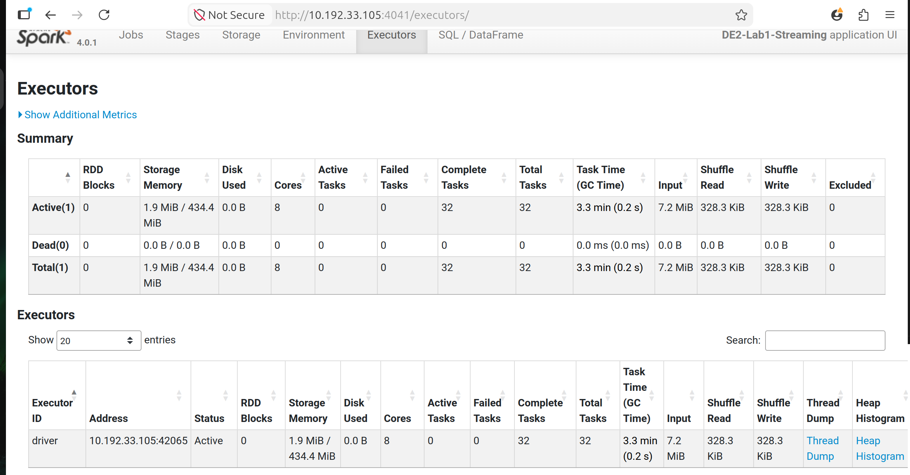
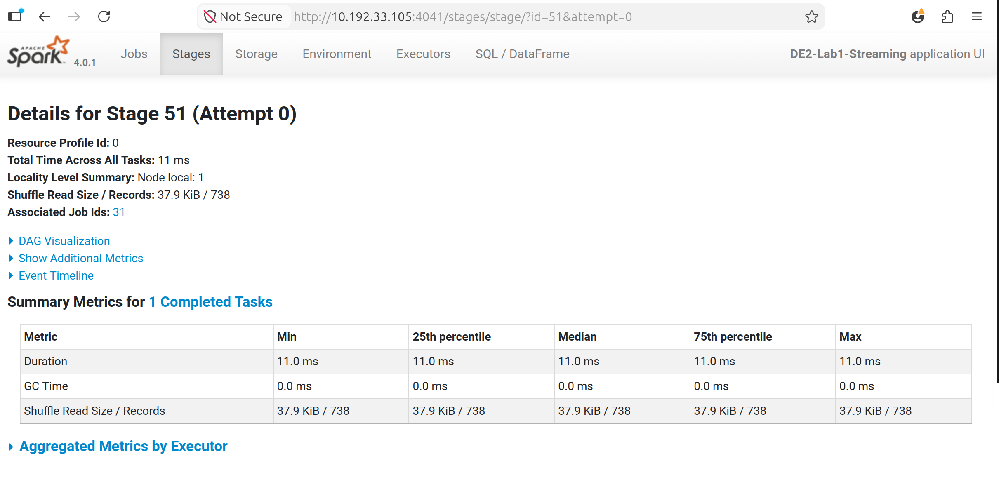

# lab1 practice - Preuves

Captures et plans d'execution generes lors du lab.

## Captures d'ecran

### Executors



### Stages



## Plans et logs

### plan_streaming_after.txt

```text
== Physical Plan ==
* HashAggregate (11)
+- StateStoreSave (10)
   +- * HashAggregate (9)
      +- StateStoreRestore (8)
         +- * HashAggregate (7)
            +- Exchange (6)
               +- * HashAggregate (5)
                  +- * Project (4)
                     +- * Filter (3)
                        +- EventTimeWatermark (2)
                           +- StreamingRelation (1)


(1) StreamingRelation
Output [5]: [match_end_time#0, team_id#1, kills#2, deaths#3, match_duration_sec#4]
Arguments: FileSource[data/stream_input/], [match_end_time#0, team_id#1, kills#2, deaths#3, match_duration_sec#4]

(2) EventTimeWatermark
Input [5]: [match_end_time#0, team_id#1, kills#2, deaths#3, match_duration_sec#4]
Arguments: 13f9c107-0499-4111-9e95-3b545d8f95cf, match_end_time#0: timestamp, 10 minutes

(3) Filter [codegen id : 1]
Input [5]: [match_end_time#0-T600000ms, team_id#1, kills#2, deaths#3, match_duration_sec#4]
Condition : isnotnull(match_end_time#0-T600000ms)

(4) Project [codegen id : 1]
Output [5]: [named_struct(start, knownnullable(precisetimestampconversion(((precisetimestampconversion(match_end_time#0-T600000ms, TimestampType, LongType) - CASE WHEN (((precisetimestampconversion(match_end_time#0-T600000ms, TimestampType, LongType) - 0) % 3600000000) < 0) THEN (((precisetimestampconversion(match_end_time#0-T600000ms, TimestampType, LongType) - 0) % 3600000000) + 3600000000) ELSE ((precisetimestampconversion(match_end_time#0-T600000ms, TimestampType, LongType) - 0) % 3600000000) END) - 0), LongType, TimestampType)), end, knownnullable(precisetimestampconversion((((precisetimestampconversion(match_end_time#0-T600000ms, TimestampType, LongType) - CASE WHEN (((precisetimestampconversion(match_end_time#0-T600000ms, TimestampType, LongType) - 0) % 3600000000) < 0) THEN (((precisetimestampconversion(match_end_time#0-T600000ms, TimestampType, LongType) - 0) % 3600000000) + 3600000000) ELSE ((precisetimestampconversion(match_end_time#0-T600000ms, TimestampType, LongType) - 0) % 3600000000) END) - 0) + 3600000000), LongType, TimestampType))) AS window#71-T600000ms, team_id#1, kills#2, deaths#3, match_duration_sec#4]
Input [5]: [match_end_time#0-T600000ms, team_id#1, kills#2, deaths#3, match_duration_sec#4]

(5) HashAggregate [codegen id : 1]
Input [5]: [window#71-T600000ms, team_id#1, kills#2, deaths#3, match_duration_sec#4]
Keys [2]: [window#71-T600000ms, team_id#1]
Functions [5]: [partial_count(1), partial_sum(kills#2), partial_sum(deaths#3), partial_avg(kills#2), partial_avg(match_duration_sec#4)]
Aggregate Attributes [5]: [count(1)#66L, sum(kills#2)#67L, sum(deaths#3)#68L, avg(kills#2)#69, avg(match_duration_sec#4)#70]
Results [9]: [window#71-T600000ms, team_id#1, count#87L, sum#89L, sum#91L, sum#94, count#95L, sum#98, count#99L]

(6) Exchange
Input [9]: [window#71-T600000ms, team_id#1, count#87L, sum#89L, sum#91L, sum#94, count#95L, sum#98, count#99L]
Arguments: hashpartitioning(window#71-T600000ms, team_id#1, 200), REQUIRED_BY_STATEFUL_OPERATOR, [plan_id=143]

(7) HashAggregate [codegen id : 2]
Input [9]: [window#71-T600000ms, team_id#1, count#87L, sum#89L, sum#91L, sum#94, count#95L, sum#98, count#99L]
Keys [2]: [window#71-T600000ms, team_id#1]
Functions [5]: [merge_count(1), merge_sum(kills#2), merge_sum(deaths#3), merge_avg(kills#2), merge_avg(match_duration_sec#4)]
Aggregate Attributes [5]: [count(1)#66L, sum(kills#2)#67L, sum(deaths#3)#68L, avg(kills#2)#69, avg(match_duration_sec#4)#70]
Results [9]: [window#71-T600000ms, team_id#1, count#87L, sum#89L, sum#91L, sum#94, count#95L, sum#98, count#99L]

(8) StateStoreRestore
Input [9]: [window#71-T600000ms, team_id#1, count#87L, sum#89L, sum#91L, sum#94, count#95L, sum#98, count#99L]
Arguments: [window#71-T600000ms, team_id#1], state info [ checkpoint = <unknown>, runId = c2b678a6-8bd3-452f-b3fc-0ef71efda9a0, opId = 0, ver = 0, numPartitions = 200] stateStoreCkptIds = None, 2

(9) HashAggregate [codegen id : 3]
Input [9]: [window#71-T600000ms, team_id#1, count#87L, sum#89L, sum#91L, sum#94, count#95L, sum#98, count#99L]
Keys [2]: [window#71-T600000ms, team_id#1]
Functions [5]: [merge_count(1), merge_sum(kills#2), merge_sum(deaths#3), merge_avg(kills#2), merge_avg(match_duration_sec#4)]
Aggregate Attributes [5]: [count(1)#66L, sum(kills#2)#67L, sum(deaths#3)#68L, avg(kills#2)#69, avg(match_duration_sec#4)#70]
Results [9]: [window#71-T600000ms, team_id#1, count#87L, sum#89L, sum#91L, sum#94, count#95L, sum#98, count#99L]

(10) StateStoreSave
Input [9]: [window#71-T600000ms, team_id#1, count#87L, sum#89L, sum#91L, sum#94, count#95L, sum#98, count#99L]
Arguments: [window#71-T600000ms, team_id#1], state info [ checkpoint = <unknown>, runId = c2b678a6-8bd3-452f-b3fc-0ef71efda9a0, opId = 0, ver = 0, numPartitions = 200] stateStoreCkptIds = None, Append, -9223372036854775808, -9223372036854775808, 2

(11) HashAggregate [codegen id : 4]
Input [9]: [window#71-T600000ms, team_id#1, count#87L, sum#89L, sum#91L, sum#94, count#95L, sum#98, count#99L]
Keys [2]: [window#71-T600000ms, team_id#1]
Functions [5]: [count(1), sum(kills#2), sum(deaths#3), avg(kills#2), avg(match_duration_sec#4)]
Aggregate Attributes [5]: [count(1)#66L, sum(kills#2)#67L, sum(deaths#3)#68L, avg(kills#2)#69, avg(match_duration_sec#4)#70]
Results [8]: [window#71-T600000ms.start AS window_start#72, window#71-T600000ms.end AS window_end#73, team_id#1, count(1)#66L AS num_matches#56L, sum(kills#2)#67L AS total_kills#57L, sum(deaths#3)#68L AS total_deaths#58L, avg(kills#2)#69 AS avg_kills_per_match#59, avg(match_duration_sec#4)#70 AS avg_match_duration_sec#60]


```

### plan_streaming_before.txt

```text
== Physical Plan ==
* HashAggregate (11)
+- StateStoreSave (10)
   +- * HashAggregate (9)
      +- StateStoreRestore (8)
         +- * HashAggregate (7)
            +- Exchange (6)
               +- * HashAggregate (5)
                  +- * Project (4)
                     +- * Filter (3)
                        +- EventTimeWatermark (2)
                           +- StreamingRelation (1)


(1) StreamingRelation
Output [5]: [match_end_time#0, team_id#1, kills#2, deaths#3, match_duration_sec#4]
Arguments: FileSource[data/stream_input/], [match_end_time#0, team_id#1, kills#2, deaths#3, match_duration_sec#4]

(2) EventTimeWatermark
Input [5]: [match_end_time#0, team_id#1, kills#2, deaths#3, match_duration_sec#4]
Arguments: ce89a23b-6ec4-485b-9416-7a0a390999a1, match_end_time#0: timestamp, 15 minutes

(3) Filter [codegen id : 1]
Input [5]: [match_end_time#0-T900000ms, team_id#1, kills#2, deaths#3, match_duration_sec#4]
Condition : isnotnull(match_end_time#0-T900000ms)

(4) Project [codegen id : 1]
Output [5]: [named_struct(start, knownnullable(precisetimestampconversion(((precisetimestampconversion(match_end_time#0-T900000ms, TimestampType, LongType) - CASE WHEN (((precisetimestampconversion(match_end_time#0-T900000ms, TimestampType, LongType) - 0) % 3600000000) < 0) THEN (((precisetimestampconversion(match_end_time#0-T900000ms, TimestampType, LongType) - 0) % 3600000000) + 3600000000) ELSE ((precisetimestampconversion(match_end_time#0-T900000ms, TimestampType, LongType) - 0) % 3600000000) END) - 0), LongType, TimestampType)), end, knownnullable(precisetimestampconversion((((precisetimestampconversion(match_end_time#0-T900000ms, TimestampType, LongType) - CASE WHEN (((precisetimestampconversion(match_end_time#0-T900000ms, TimestampType, LongType) - 0) % 3600000000) < 0) THEN (((precisetimestampconversion(match_end_time#0-T900000ms, TimestampType, LongType) - 0) % 3600000000) + 3600000000) ELSE ((precisetimestampconversion(match_end_time#0-T900000ms, TimestampType, LongType) - 0) % 3600000000) END) - 0) + 3600000000), LongType, TimestampType))) AS window#21-T900000ms, team_id#1, kills#2, deaths#3, match_duration_sec#4]
Input [5]: [match_end_time#0-T900000ms, team_id#1, kills#2, deaths#3, match_duration_sec#4]

(5) HashAggregate [codegen id : 1]
Input [5]: [window#21-T900000ms, team_id#1, kills#2, deaths#3, match_duration_sec#4]
Keys [2]: [window#21-T900000ms, team_id#1]
Functions [5]: [partial_count(1), partial_sum(kills#2), partial_sum(deaths#3), partial_avg(kills#2), partial_avg(match_duration_sec#4)]
Aggregate Attributes [5]: [count(1)#16L, sum(kills#2)#17L, sum(deaths#3)#18L, avg(kills#2)#19, avg(match_duration_sec#4)#20]
Results [9]: [window#21-T900000ms, team_id#1, count#37L, sum#39L, sum#41L, sum#44, count#45L, sum#48, count#49L]

(6) Exchange
Input [9]: [window#21-T900000ms, team_id#1, count#37L, sum#39L, sum#41L, sum#44, count#45L, sum#48, count#49L]
Arguments: hashpartitioning(window#21-T900000ms, team_id#1, 200), REQUIRED_BY_STATEFUL_OPERATOR, [plan_id=59]

(7) HashAggregate [codegen id : 2]
Input [9]: [window#21-T900000ms, team_id#1, count#37L, sum#39L, sum#41L, sum#44, count#45L, sum#48, count#49L]
Keys [2]: [window#21-T900000ms, team_id#1]
Functions [5]: [merge_count(1), merge_sum(kills#2), merge_sum(deaths#3), merge_avg(kills#2), merge_avg(match_duration_sec#4)]
Aggregate Attributes [5]: [count(1)#16L, sum(kills#2)#17L, sum(deaths#3)#18L, avg(kills#2)#19, avg(match_duration_sec#4)#20]
Results [9]: [window#21-T900000ms, team_id#1, count#37L, sum#39L, sum#41L, sum#44, count#45L, sum#48, count#49L]

(8) StateStoreRestore
Input [9]: [window#21-T900000ms, team_id#1, count#37L, sum#39L, sum#41L, sum#44, count#45L, sum#48, count#49L]
Arguments: [window#21-T900000ms, team_id#1], state info [ checkpoint = <unknown>, runId = 2ba24a41-d346-4f0a-9087-b5318b5cbf7e, opId = 0, ver = 0, numPartitions = 200] stateStoreCkptIds = None, 2

(9) HashAggregate [codegen id : 3]
Input [9]: [window#21-T900000ms, team_id#1, count#37L, sum#39L, sum#41L, sum#44, count#45L, sum#48, count#49L]
Keys [2]: [window#21-T900000ms, team_id#1]
Functions [5]: [merge_count(1), merge_sum(kills#2), merge_sum(deaths#3), merge_avg(kills#2), merge_avg(match_duration_sec#4)]
Aggregate Attributes [5]: [count(1)#16L, sum(kills#2)#17L, sum(deaths#3)#18L, avg(kills#2)#19, avg(match_duration_sec#4)#20]
Results [9]: [window#21-T900000ms, team_id#1, count#37L, sum#39L, sum#41L, sum#44, count#45L, sum#48, count#49L]

(10) StateStoreSave
Input [9]: [window#21-T900000ms, team_id#1, count#37L, sum#39L, sum#41L, sum#44, count#45L, sum#48, count#49L]
Arguments: [window#21-T900000ms, team_id#1], state info [ checkpoint = <unknown>, runId = 2ba24a41-d346-4f0a-9087-b5318b5cbf7e, opId = 0, ver = 0, numPartitions = 200] stateStoreCkptIds = None, Append, -9223372036854775808, -9223372036854775808, 2

(11) HashAggregate [codegen id : 4]
Input [9]: [window#21-T900000ms, team_id#1, count#37L, sum#39L, sum#41L, sum#44, count#45L, sum#48, count#49L]
Keys [2]: [window#21-T900000ms, team_id#1]
Functions [5]: [count(1), sum(kills#2), sum(deaths#3), avg(kills#2), avg(match_duration_sec#4)]
Aggregate Attributes [5]: [count(1)#16L, sum(kills#2)#17L, sum(deaths#3)#18L, avg(kills#2)#19, avg(match_duration_sec#4)#20]
Results [8]: [window#21-T900000ms.start AS window_start#22, window#21-T900000ms.end AS window_end#23, team_id#1, count(1)#16L AS num_matches#6L, sum(kills#2)#17L AS total_kills#7L, sum(deaths#3)#18L AS total_deaths#8L, avg(kills#2)#19 AS avg_kills_per_match#9, avg(match_duration_sec#4)#20 AS avg_match_duration_sec#10]


```

### plan_streaming.txt

```text
PLAN D'AGRÉGATION GITHUB ARCHIVE (Track B)
================================================================================

== Physical Plan ==
AdaptiveSparkPlan (11)
+- HashAggregate (10)
   +- Exchange (9)
      +- HashAggregate (8)
         +- HashAggregate (7)
            +- Exchange (6)
               +- HashAggregate (5)
                  +- Project (4)
                     +- Project (3)
                        +- Filter (2)
                           +- Scan json  (1)


(1) Scan json 
Output [5]: [type#1008, created_at#1009, public#1010, repo#1011, actor#1012]
Batched: false
Location: InMemoryFileIndex [file:/home/sable/Documents/E4FD/S4/Data Engineering/sample_archive_github.json]
PushedFilters: [IsNotNull(created_at)]
ReadSchema: struct<type:string,created_at:string,public:boolean,repo:struct<id:bigint,name:string,url:string>,actor:struct<id:bigint,login:string,display_login:string>>

(2) Filter
Input [5]: [type#1008, created_at#1009, public#1010, repo#1011, actor#1012]
Condition : (isnotnull(created_at#1009) AND isnotnull(cast(created_at#1009 as timestamp)))

(3) Project
Output [5]: [type#1008, cast(created_at#1009 as timestamp) AS event_time#1023, public#1010, repo#1011.name AS repo_name#1024, actor#1012.login AS actor_login#1025]
Input [5]: [type#1008, created_at#1009, public#1010, repo#1011, actor#1012]

(4) Project
Output [5]: [named_struct(start, knownnullable(precisetimestampconversion(((precisetimestampconversion(event_time#1023, TimestampType, LongType) - CASE WHEN (((precisetimestampconversion(event_time#1023, TimestampType, LongType) - 0) % 3600000000) < 0) THEN (((precisetimestampconversion(event_time#1023, TimestampType, LongType) - 0) % 3600000000) + 3600000000) ELSE ((precisetimestampconversion(event_time#1023, TimestampType, LongType) - 0) % 3600000000) END) - 0), LongType, TimestampType)), end, knownnullable(precisetimestampconversion((((precisetimestampconversion(event_time#1023, TimestampType, LongType) - CASE WHEN (((precisetimestampconversion(event_time#1023, TimestampType, LongType) - 0) % 3600000000) < 0) THEN (((precisetimestampconversion(event_time#1023, TimestampType, LongType) - 0) % 3600000000) + 3600000000) ELSE ((precisetimestampconversion(event_time#1023, TimestampType, LongType) - 0) % 3600000000) END) - 0) + 3600000000), LongType, TimestampType))) AS window#1068, type#1008, public#1010, repo_name#1024, actor_login#1025]
Input [5]: [type#1008, event_time#1023, public#1010, repo_name#1024, actor_login#1025]

(5) HashAggregate
Input [5]: [window#1068, type#1008, public#1010, repo_name#1024, actor_login#1025]
Keys [4]: [window#1068, type#1008, repo_name#1024, actor_login#1025]
Functions [3]: [partial_count(1), partial_sum(CASE WHEN public#1010 THEN 1 ELSE 0 END), partial_sum(CASE WHEN NOT public#1010 THEN 1 ELSE 0 END)]
Aggregate Attributes [3]: [count(1)#1064L, sum(CASE WHEN public#1010 THEN 1 ELSE 0 END)#1066L, sum(CASE WHEN NOT public#1010 THEN 1 ELSE 0 END)#1067L]
Results [7]: [window#1068, type#1008, repo_name#1024, actor_login#1025, count#1082L, sum#1084L, sum#1086L]

(6) Exchange
Input [7]: [window#1068, type#1008, repo_name#1024, actor_login#1025, count#1082L, sum#1084L, sum#1086L]
Arguments: hashpartitioning(window#1068, type#1008, repo_name#1024, actor_login#1025, 200), ENSURE_REQUIREMENTS, [plan_id=2044]

(7) HashAggregate
Input [7]: [window#1068, type#1008, repo_name#1024, actor_login#1025, count#1082L, sum#1084L, sum#1086L]
Keys [4]: [window#1068, type#1008, repo_name#1024, actor_login#1025]
Functions [3]: [merge_count(1), merge_sum(CASE WHEN public#1010 THEN 1 ELSE 0 END), merge_sum(CASE WHEN NOT public#1010 THEN 1 ELSE 0 END)]
Aggregate Attributes [3]: [count(1)#1064L, sum(CASE WHEN public#1010 THEN 1 ELSE 0 END)#1066L, sum(CASE WHEN NOT public#1010 THEN 1 ELSE 0 END)#1067L]
Results [7]: [window#1068, type#1008, repo_name#1024, actor_login#1025, count#1082L, sum#1084L, sum#1086L]

(8) HashAggregate
Input [7]: [window#1068, type#1008, repo_name#1024, actor_login#1025, count#1082L, sum#1084L, sum#1086L]
Keys [3]: [window#1068, type#1008, repo_name#1024]
Functions [4]: [merge_count(1), merge_sum(CASE WHEN public#1010 THEN 1 ELSE 0 END), merge_sum(CASE WHEN NOT public#1010 THEN 1 ELSE 0 END), partial_count(distinct actor_login#1025)]
Aggregate Attributes [4]: [count(1)#1064L, sum(CASE WHEN public#1010 THEN 1 ELSE 0 END)#1066L, sum(CASE WHEN NOT public#1010 THEN 1 ELSE 0 END)#1067L, count(actor_login#1025)#1065L]
Results [7]: [window#1068, type#1008, repo_name#1024, count#1082L, sum#1084L, sum#1086L, count#1089L]

(9) Exchange
Input [7]: [window#1068, type#1008, repo_name#1024, count#1082L, sum#1084L, sum#1086L, count#1089L]
Arguments: hashpartitioning(window#1068, type#1008, repo_name#1024, 200), ENSURE_REQUIREMENTS, [plan_id=2048]

(10) HashAggregate
Input [7]: [window#1068, type#1008, repo_name#1024, count#1082L, sum#1084L, sum#1086L, count#1089L]
Keys [3]: [window#1068, type#1008, repo_name#1024]
Functions [4]: [count(1), sum(CASE WHEN public#1010 THEN 1 ELSE 0 END), sum(CASE WHEN NOT public#1010 THEN 1 ELSE 0 END), count(distinct actor_login#1025)]
Aggregate Attributes [4]: [count(1)#1064L, sum(CASE WHEN public#1010 THEN 1 ELSE 0 END)#1066L, sum(CASE WHEN NOT public#1010 THEN 1 ELSE 0 END)#1067L, count(actor_login#1025)#1065L]
Results [8]: [window#1068.start AS window_start#1069, window#1068.end AS window_end#1070, type#1008, repo_name#1024, count(1)#1064L AS total_events#1054L, count(actor_login#1025)#1065L AS unique_actors#1055L, sum(CASE WHEN public#1010 THEN 1 ELSE 0 END)#1066L AS public_events#1056L, sum(CASE WHEN NOT public#1010 THEN 1 ELSE 0 END)#1067L AS private_events#1057L]

(11) AdaptiveSparkPlan
Output [8]: [window_start#1069, window_end#1070, type#1008, repo_name#1024, total_events#1054L, unique_actors#1055L, public_events#1056L, private_events#1057L]
Arguments: isFinalPlan=false


```

### RAPPORT_LAB1.txt

```text

RAPPORT D'ANALYSE - Lab 1: GitHub Archive (Track B)
================================================================================

Dataset: sample_archive_github.json
Taille: 1000 événements GitHub publics

Résumé de l'agrégation:
- Fenêtres d'1 heure: 793
- Types d'événements uniques: 13
- Repositories uniques: 738
- Total d'événements traités: 1000
- Acteurs uniques: 799

Objectifs du Lab:
- Construire un pipeline Spark Structured Streaming
- Appliquer windowing et watermarks sur données réelles
- Persister les résultats en Parquet
- Capturer les métriques de performance

Concepts validés:
- Lecture de schéma JSON complexe avec structures imbriquées
- Transformation de données (extraction de champs imbriqués)
- Windowing temporel (tumbling windows)
- Agrégations complexes (distinct, conditional sum)
- Output Parquet avec mode append

Preuves:
- proof/aggregation_metrics.json: Métriques d'agrégation
- proof/plan_streaming.txt: Plan de requête optimisé
- outputs/lab1/stream_sink/: Fichiers Parquet des résultats

```

## Donnees brutes

### aggregation_metrics.json

[Telecharger aggregation_metrics.json](./aggregation_metrics.json)

```json
{
  "total_windows": 793,
  "event_types": 13,
  "repositories": 738,
  "total_events_processed": 1000,
  "total_unique_actors": 799,
  "avg_events_per_window": 1.2610340479192939
}
```

### query_progress_after.json

[Telecharger query_progress_after.json](./query_progress_after.json)

```json
{
  "id": "1923b44f-6668-432a-a9b0-e3c84f61c6d2",
  "runId": "e0a29307-2dee-4afc-9868-c26268bf8c8f",
  "name": null,
  "timestamp": "2026-04-29T09:32:30.000Z",
  "batchId": 0,
  "batchDuration": 16,
  "durationMs": {
    "triggerExecution": 15,
    "latestOffset": 15
  },
  "eventTime": {},
  "stateOperators": [],
  "sources": [
    {
      "description": "FileStreamSource[file:/home/sable/Documents/E4FD/S4/Data Engineering/Data Engineering 2/lab1 practice/data/stream_input]",
      "startOffset": "None",
      "endOffset": "None",
      "latestOffset": "None",
      "numInputRows": 0,
      "inputRowsPerSecond": 0.0,
      "processedRowsPerSecond": 0.0,
      "metrics": {}
    }
  ],
  "sink": {
    "description": "FileSink[file:/home/sable/Documents/E4FD/S4/Data Engineering/Data Engineering 2/lab1 practice/outputs/lab1/stream_sink_optimized]",
    "numOutputRows": -1,
    "metrics": {}
  },
  "numInputRows": 0,
  "inputRowsPerSecond": 0.0,
  "processedRowsPerSecond": 0.0,
  "observedMetrics": {}
}
```

### query_progress_before.json

[Telecharger query_progress_before.json](./query_progress_before.json)

```json
{
  "id": "68628729-0ab5-4dda-a826-294b8c1bf980",
  "runId": "2449abc1-b30a-48bf-a874-5c2334dc529e",
  "name": null,
  "timestamp": "2026-04-29T09:31:50.000Z",
  "batchId": 0,
  "batchDuration": 15,
  "durationMs": {
    "triggerExecution": 15,
    "latestOffset": 14
  },
  "eventTime": {},
  "stateOperators": [],
  "sources": [
    {
      "description": "FileStreamSource[file:/home/sable/Documents/E4FD/S4/Data Engineering/Data Engineering 2/lab1 practice/data/stream_input]",
      "startOffset": "None",
      "endOffset": "None",
      "latestOffset": "None",
      "numInputRows": 0,
      "inputRowsPerSecond": 0.0,
      "processedRowsPerSecond": 0.0,
      "metrics": {}
    }
  ],
  "sink": {
    "description": "FileSink[file:/home/sable/Documents/E4FD/S4/Data Engineering/Data Engineering 2/lab1 practice/outputs/lab1/stream_sink]",
    "numOutputRows": -1,
    "metrics": {}
  },
  "numInputRows": 0,
  "inputRowsPerSecond": 0.0,
  "processedRowsPerSecond": 0.0,
  "observedMetrics": {}
}
```

