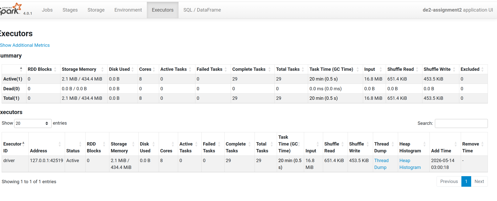
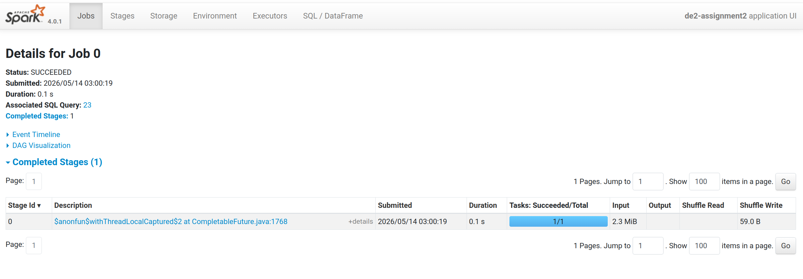

# lab2 assignment - Preuves

Captures et plans d'execution generes lors du lab.

## Captures d'ecran

### Executors



### JObs



## Plans et logs

### plan_index_build.txt

```text
== Physical Plan ==
AdaptiveSparkPlan (11)
+- Sort (10)
   +- Exchange (9)
      +- ObjectHashAggregate (8)
         +- Exchange (7)
            +- ObjectHashAggregate (6)
               +- Filter (5)
                  +- Generate (4)
                     +- Project (3)
                        +- Filter (2)
                           +- Scan json  (1)


(1) Scan json 
Output [4]: [id#0, type#1, repo#2, actor#3]
Batched: false
Location: InMemoryFileIndex [file:/home/sable/Documents/E4FD/S4/Data Engineering/sample_archive_github.json]
ReadSchema: struct<id:string,type:string,repo:struct<name:string>,actor:struct<login:string>>

(2) Filter
Input [4]: [id#0, type#1, repo#2, actor#3]
Condition : (size(split(lower(regexp_replace(concat_ws( , type#1, repo#2.name, actor#3.login), [^a-zA-Z0-9\s], , 1)), \s+, -1), false) > 0)

(3) Project
Output [2]: [id#0 AS doc_id#4, split(lower(regexp_replace(concat_ws( , type#1, repo#2.name, actor#3.login), [^a-zA-Z0-9\s], , 1)), \s+, -1) AS tokens#27]
Input [4]: [id#0, type#1, repo#2, actor#3]

(4) Generate
Input [2]: [doc_id#4, tokens#27]
Arguments: explode(tokens#27), [doc_id#4], false, [token#40]

(5) Filter
Input [2]: [doc_id#4, token#40]
Condition : (NOT (token#40 = ) AND NOT token#40 INSET a, an, and, are, as, at, be, been, being, but, by, can, could, did, do, does, for, from, had, has, have, how, in, is, it, may, might, of, on, or, should, that, the, this, to, was, were, what, when, where, which, who, why, will, with, would)

(6) ObjectHashAggregate
Input [2]: [doc_id#4, token#40]
Keys [1]: [token#40]
Functions [2]: [partial_collect_list(doc_id#4, 0, 0), partial_count(1)]
Aggregate Attributes [2]: [buf#80, count#81L]
Results [3]: [token#40, buf#82, count#83L]

(7) Exchange
Input [3]: [token#40, buf#82, count#83L]
Arguments: hashpartitioning(token#40, 200), ENSURE_REQUIREMENTS, [plan_id=800]

(8) ObjectHashAggregate
Input [3]: [token#40, buf#82, count#83L]
Keys [1]: [token#40]
Functions [2]: [collect_list(doc_id#4, 0, 0), count(1)]
Aggregate Attributes [2]: [collect_list(doc_id#4, 0, 0)#66, count(1)#65L]
Results [3]: [token#40, collect_list(doc_id#4, 0, 0)#66 AS doc_ids#61, count(1)#65L AS freq#62L]

(9) Exchange
Input [3]: [token#40, doc_ids#61, freq#62L]
Arguments: rangepartitioning(freq#62L DESC NULLS LAST, 200), ENSURE_REQUIREMENTS, [plan_id=803]

(10) Sort
Input [3]: [token#40, doc_ids#61, freq#62L]
Arguments: [freq#62L DESC NULLS LAST], true, 0

(11) AdaptiveSparkPlan
Output [3]: [token#40, doc_ids#61, freq#62L]
Arguments: isFinalPlan=false


```

### plan_query.txt

```text
== Physical Plan ==
* Filter (3)
+- * ColumnarToRow (2)
   +- Scan parquet  (1)


(1) Scan parquet 
Output [3]: [token#146, doc_ids#147, freq#148L]
Batched: true
Location: InMemoryFileIndex [file:/home/sable/Documents/E4FD/S4/Data Engineering/Data Engineering 2/lab2 assignment/outputs/lab2/inverted_index]
PushedFilters: [IsNotNull(token), EqualTo(token,pushevent)]
ReadSchema: struct<token:string,doc_ids:array<string>,freq:bigint>

(2) ColumnarToRow [codegen id : 1]
Input [3]: [token#146, doc_ids#147, freq#148L]

(3) Filter [codegen id : 1]
Input [3]: [token#146, doc_ids#147, freq#148L]
Condition : (isnotnull(token#146) AND (token#146 = pushevent))


```

