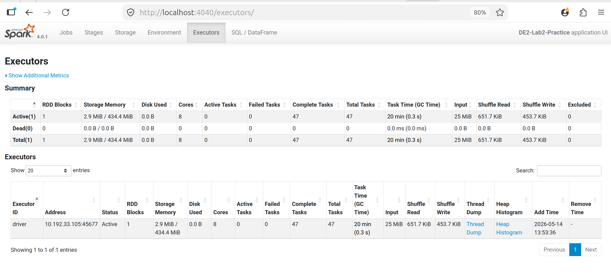
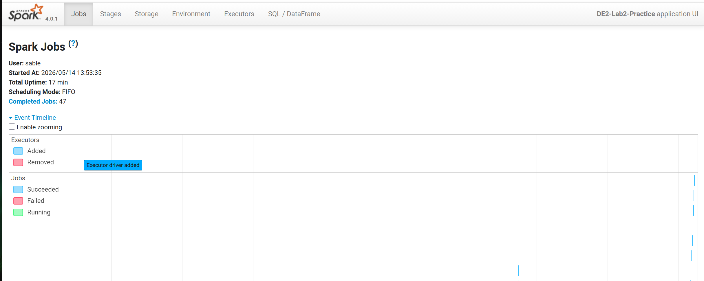
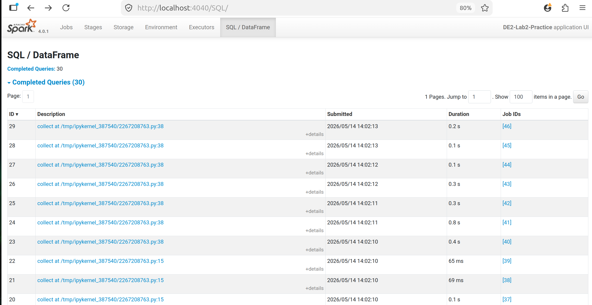
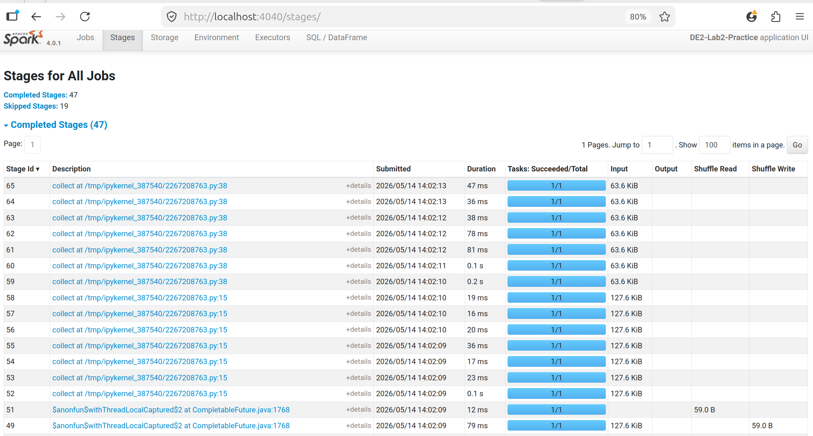

# lab2 practice - Preuves

Captures et plans d'execution generes lors du lab.

## Captures d'ecran

### Executors



### JObs



### SQL



### Stages



## Plans et logs

### plan_index_build.txt

```text
== Physical Plan ==
AdaptiveSparkPlan (11)
+- Sort (10)
   +- Exchange (9)
      +- ObjectHashAggregate (8)
         +- Exchange (7)
            +- ObjectHashAggregate (6)
               +- Filter (5)
                  +- Generate (4)
                     +- Project (3)
                        +- Filter (2)
                           +- Scan json  (1)


(1) Scan json 
Output [4]: [id#0, type#1, repo#2, actor#3]
Batched: false
Location: InMemoryFileIndex [file:/home/sable/Documents/E4FD/S4/Data Engineering/sample_archive_github.json]
ReadSchema: struct<id:string,type:string,repo:struct<name:string>,actor:struct<login:string>>

(2) Filter
Input [4]: [id#0, type#1, repo#2, actor#3]
Condition : (size(split(lower(regexp_replace(concat_ws( , type#1, repo#2.name, actor#3.login), [^a-zA-Z0-9\s], , 1)), \s+, -1), false) > 0)

(3) Project
Output [2]: [id#0 AS doc_id#4, split(lower(regexp_replace(concat_ws( , type#1, repo#2.name, actor#3.login), [^a-zA-Z0-9\s], , 1)), \s+, -1) AS tokens#75]
Input [4]: [id#0, type#1, repo#2, actor#3]

(4) Generate
Input [2]: [doc_id#4, tokens#75]
Arguments: explode(tokens#75), [doc_id#4], false, [token#88]

(5) Filter
Input [2]: [doc_id#4, token#88]
Condition : (NOT (token#88 = ) AND NOT token#88 INSET a, an, and, are, as, at, be, been, being, but, by, can, could, did, do, does, for, from, had, has, have, how, in, is, it, may, might, of, on, or, should, that, the, this, to, was, were, what, when, where, which, who, why, will, with, would)

(6) ObjectHashAggregate
Input [2]: [doc_id#4, token#88]
Keys [1]: [token#88]
Functions [2]: [partial_collect_list(doc_id#4, 0, 0), partial_count(1)]
Aggregate Attributes [2]: [buf#128, count#129L]
Results [3]: [token#88, buf#130, count#131L]

(7) Exchange
Input [3]: [token#88, buf#130, count#131L]
Arguments: hashpartitioning(token#88, 200), ENSURE_REQUIREMENTS, [plan_id=1101]

(8) ObjectHashAggregate
Input [3]: [token#88, buf#130, count#131L]
Keys [1]: [token#88]
Functions [2]: [collect_list(doc_id#4, 0, 0), count(1)]
Aggregate Attributes [2]: [collect_list(doc_id#4, 0, 0)#114, count(1)#113L]
Results [3]: [token#88, collect_list(doc_id#4, 0, 0)#114 AS doc_ids#109, count(1)#113L AS freq#110L]

(9) Exchange
Input [3]: [token#88, doc_ids#109, freq#110L]
Arguments: rangepartitioning(freq#110L DESC NULLS LAST, 200), ENSURE_REQUIREMENTS, [plan_id=1104]

(10) Sort
Input [3]: [token#88, doc_ids#109, freq#110L]
Arguments: [freq#110L DESC NULLS LAST], true, 0

(11) AdaptiveSparkPlan
Output [3]: [token#88, doc_ids#109, freq#110L]
Arguments: isFinalPlan=false


```

### plan_query.txt

```text
== Physical Plan ==
* Filter (5)
+- InMemoryTableScan (1)
      +- InMemoryRelation (2)
            +- * ColumnarToRow (4)
               +- Scan parquet  (3)


(1) InMemoryTableScan
Output [3]: [token#194, doc_ids#195, freq#196L]
Arguments: [token#194, doc_ids#195, freq#196L], [isnotnull(token#194), (token#194 = pushevent)]

(2) InMemoryRelation
Arguments: [token#194, doc_ids#195, freq#196L], StorageLevel(disk, memory, deserialized, 1 replicas)

(3) Scan parquet 
Output [3]: [token#194, doc_ids#195, freq#196L]
Batched: true
Location: InMemoryFileIndex [file:/home/sable/Documents/E4FD/S4/Data Engineering/Data Engineering 2/lab2 practice/outputs/lab2/inverted_index]
ReadSchema: struct<token:string,doc_ids:array<string>,freq:bigint>

(4) ColumnarToRow [codegen id : 1]
Input [3]: [token#194, doc_ids#195, freq#196L]

(5) Filter [codegen id : 1]
Input [3]: [token#194, doc_ids#195, freq#196L]
Condition : (isnotnull(token#194) AND (token#194 = pushevent))


```

