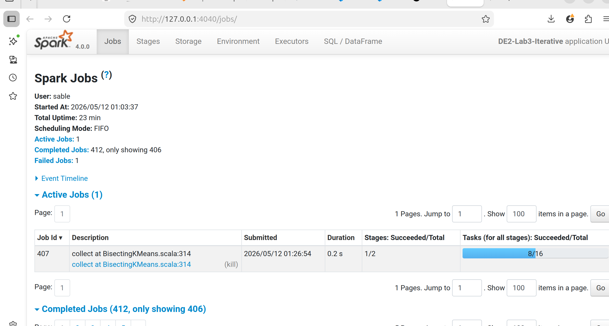
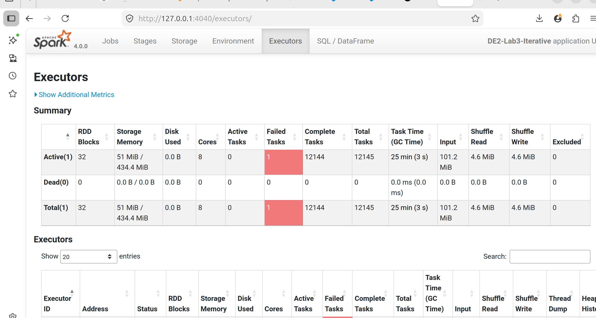
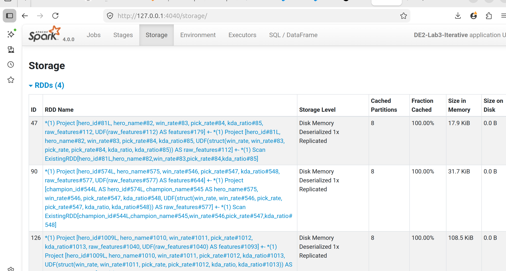
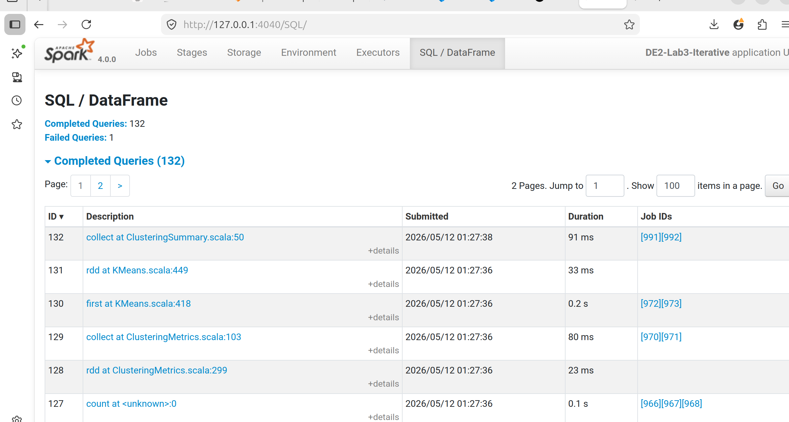

# lab3 practice - Preuves

Captures et plans d'execution generes lors du lab.

## Captures d'ecran

### jobs3



### jobs4



### jobs



### jobs-Sql



## Plans et logs

### plan_iterative.txt

```text
== Parsed Logical Plan ==
'Project [unresolvedstarwithcolumns(prediction, UDF('features) AS prediction#23756, None)]
+- Project [hero_id#1458L, hero_name#1459, win_rate#1460, pick_rate#1461, kda_ratio#1462, raw_features#1489, UDF(raw_features#1489) AS features#1542]
   +- Project [hero_id#1458L, hero_name#1459, win_rate#1460, pick_rate#1461, kda_ratio#1462, UDF(struct(win_rate, win_rate#1460, pick_rate, pick_rate#1461, kda_ratio, kda_ratio#1462)) AS raw_features#1489]
      +- LogicalRDD [hero_id#1458L, hero_name#1459, win_rate#1460, pick_rate#1461, kda_ratio#1462], false

== Analyzed Logical Plan ==
hero_id: bigint, hero_name: string, win_rate: double, pick_rate: double, kda_ratio: double, raw_features: vector, features: vector, prediction: int
Project [hero_id#1458L, hero_name#1459, win_rate#1460, pick_rate#1461, kda_ratio#1462, raw_features#1489, features#1542, UDF(features#1542) AS prediction#23757]
+- Project [hero_id#1458L, hero_name#1459, win_rate#1460, pick_rate#1461, kda_ratio#1462, raw_features#1489, UDF(raw_features#1489) AS features#1542]
   +- Project [hero_id#1458L, hero_name#1459, win_rate#1460, pick_rate#1461, kda_ratio#1462, UDF(struct(win_rate, win_rate#1460, pick_rate, pick_rate#1461, kda_ratio, kda_ratio#1462)) AS raw_features#1489]
      +- LogicalRDD [hero_id#1458L, hero_name#1459, win_rate#1460, pick_rate#1461, kda_ratio#1462], false

== Optimized Logical Plan ==
Project [hero_id#1458L, hero_name#1459, win_rate#1460, pick_rate#1461, kda_ratio#1462, raw_features#1489, features#1542, UDF(features#1542) AS prediction#23757]
+- InMemoryRelation [hero_id#1458L, hero_name#1459, win_rate#1460, pick_rate#1461, kda_ratio#1462, raw_features#1489, features#1542], StorageLevel(disk, memory, deserialized, 1 replicas)
      +- *(1) Project [hero_id#1458L, hero_name#1459, win_rate#1460, pick_rate#1461, kda_ratio#1462, raw_features#1489, UDF(raw_features#1489) AS features#1542]
         +- *(1) Project [hero_id#1458L, hero_name#1459, win_rate#1460, pick_rate#1461, kda_ratio#1462, UDF(struct(win_rate, win_rate#1460, pick_rate, pick_rate#1461, kda_ratio, kda_ratio#1462)) AS raw_features#1489]
            +- *(1) Scan ExistingRDD[hero_id#1458L,hero_name#1459,win_rate#1460,pick_rate#1461,kda_ratio#1462]

== Physical Plan ==
*(1) Project [hero_id#1458L, hero_name#1459, win_rate#1460, pick_rate#1461, kda_ratio#1462, raw_features#1489, features#1542, UDF(features#1542) AS prediction#23757]
+- InMemoryTableScan [features#1542, hero_id#1458L, hero_name#1459, kda_ratio#1462, pick_rate#1461, raw_features#1489, win_rate#1460]
      +- InMemoryRelation [hero_id#1458L, hero_name#1459, win_rate#1460, pick_rate#1461, kda_ratio#1462, raw_features#1489, features#1542], StorageLevel(disk, memory, deserialized, 1 replicas)
            +- *(1) Project [hero_id#1458L, hero_name#1459, win_rate#1460, pick_rate#1461, kda_ratio#1462, raw_features#1489, UDF(raw_features#1489) AS features#1542]
               +- *(1) Project [hero_id#1458L, hero_name#1459, win_rate#1460, pick_rate#1461, kda_ratio#1462, UDF(struct(win_rate, win_rate#1460, pick_rate, pick_rate#1461, kda_ratio, kda_ratio#1462)) AS raw_features#1489]
                  +- *(1) Scan ExistingRDD[hero_id#1458L,hero_name#1459,win_rate#1460,pick_rate#1461,kda_ratio#1462]

```

### summary.txt

```text
Lab 3 - Resume - 2026-05-12 01:26:11
Meilleure config sweep : KMeans k=6 silhouette=0.4635
Stabilite (KMeans k=6) : moyenne=0.4691, ecart-type=0.0080
Partition la plus rapide : repartition=2 clusters_reels=6 (1471.9 ms)
Total de runs enregistres : 18
```

