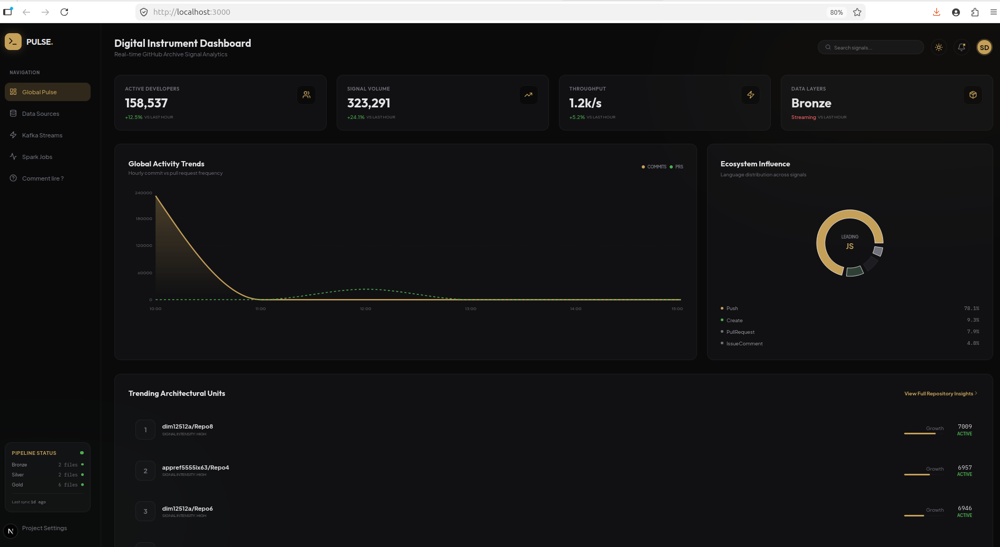
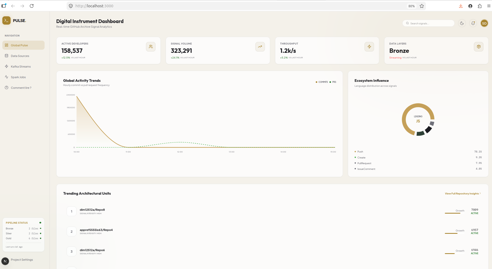
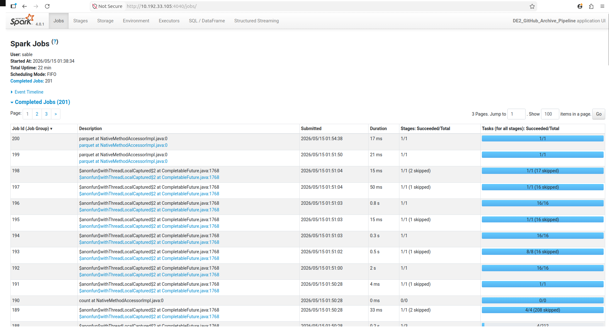
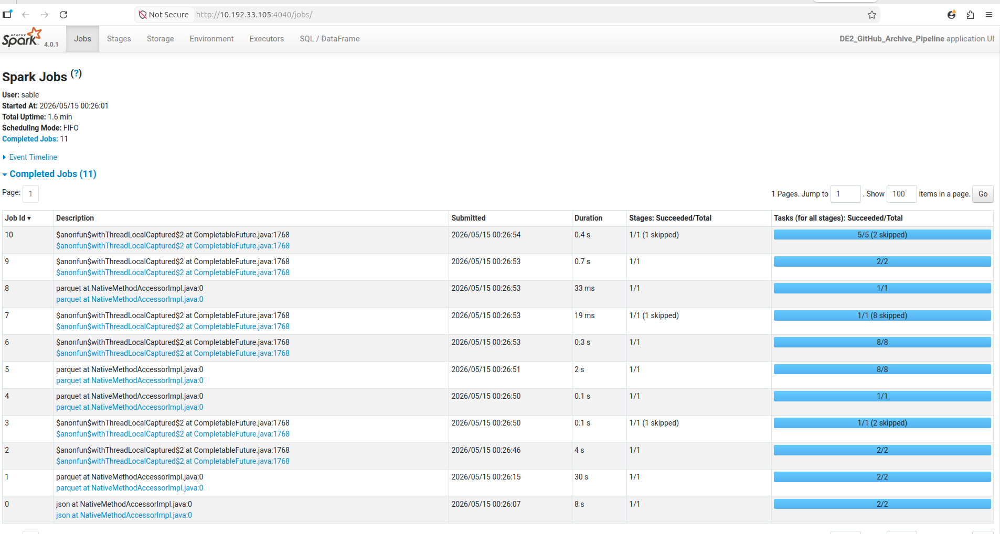
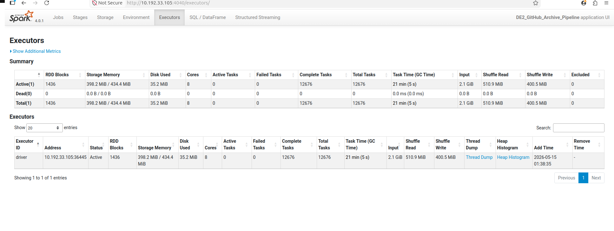
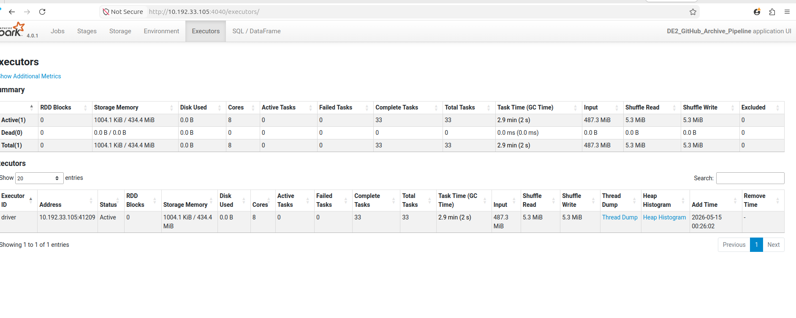
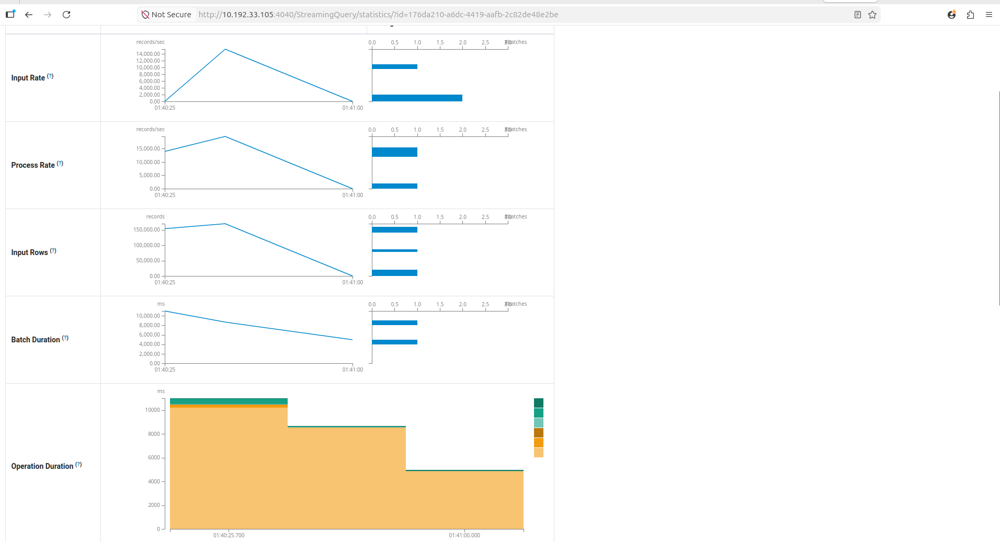

# Projet Final DE2 — Preuves d'exécution

Captures du dashboard temps réel, de la Spark UI (Jobs / Executors) et du calcul PageRank, plus les plans d'exécution générés par le pipeline.

> 🔗 **Dashboard en ligne (démo live)** : **https://de2-dashboard-e2e.pages.dev/**

---

## Dashboard temps réel

### Mode sombre — « Luxe de Minuit »

### Mode clair — « Aurore »

---

## Spark UI — Jobs & Executors

### Jobs du pipeline (projet final)

### Jobs Spark

### Executors (projet final)

### Executors

---

## Traitement de graphe — PageRank

### Jobs Spark du calcul PageRank

### Résultats PageRank

---

## Plans d'exécution

- [Plan — agrégation Gold](./plan_gold_query.txt)
- [Plan — PageRank itératif](./plan_iterative_pagerank.txt)
