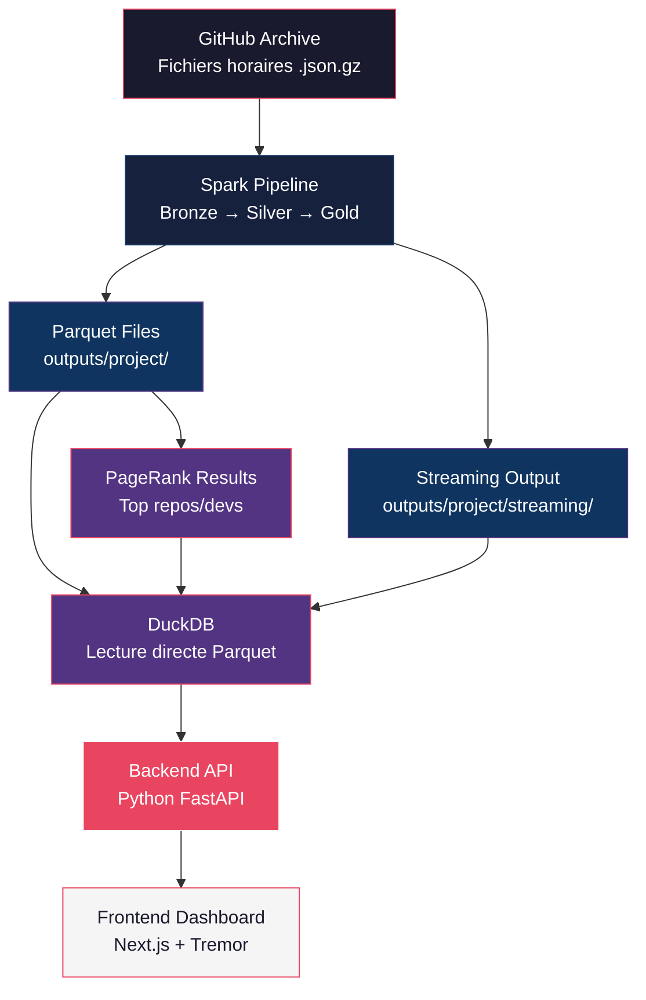
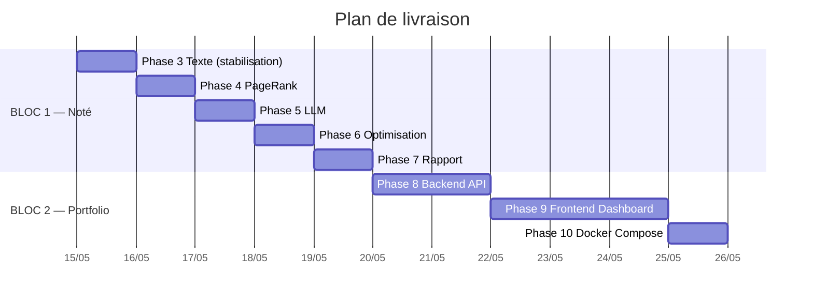

# Plan d'Action Global — GitHub Archive Data Engineering

## Contexte et état actuel

Le projet est un pipeline Data Engineering complet sur les données **GitHub Archive (Track B)**, combinant le **cœur noté du professeur** et une **plateforme analytics temps réel** pour le portfolio.

### ✅ Ce qui est terminé (Phases 0-2)
| Phase | Statut | Détails |
|-------|--------|---------|
| **Phase 0** — Bootstrap | ✅ | Spark 4.x, conda, config YAML, structure dépôt |
| **Phase 1** — Batch ETL | ✅ | Bronze → Silver → Gold, 323K+ événements, métriques enregistrées |
| **Phase 2** — Streaming | ✅ | Structured Streaming, watermark 10min, fenêtre 5min, sink Parquet, `lastProgress` capturé |
| **Phase 3** — Texte (partiel) | ⚠️ | Index inversé construit, latence mesurée, **mais le code a des erreurs à stabiliser** |
| **Phases 4-7** | ⚠️ | Cellules créées dans le notebook mais **jamais exécutées avec succès de bout en bout** |

### 🎯 Ce qui reste à faire

**BLOC 1** — Cœur noté du professeur (Partie B = 15 pts)
**BLOC 2** — Plateforme portfolio (Backend + Frontend Dashboard)

---

## Choix stratégique : PageRank vs KMeans

> [!IMPORTANT]
> **Recommandation : PageRank (Graphe)** — C'est le choix optimal pour les données GitHub Archive.

### Justification technique

| Critère | PageRank (Graphe) | KMeans (Clustering) |
|---------|-------------------|---------------------|
| **Adéquation aux données** | ⭐⭐⭐ Les données GitHub forment un **graphe naturel** (dev → repo, repo ↔ repo via forks/PR) | ⭐⭐ Features artificielles à construire (nb push, stars, etc.) |
| **Richesse des résultats** | "Repos les plus influents", "Développeurs les plus connectés" — résultats **immédiatement compréhensibles** | Clusters abstraits, difficiles à interpréter |
| **Preuves de convergence** | Delta PageRank par itération → courbe de convergence claire | Silhouette score, mais interprétation plus fragile |
| **Analyse shuffle** | Le shuffle inter-partition est le **cœur** du problème → preuves riches | Moins de shuffle visible dans les plans |
| **Le prof le recommande** | *"le graphe est la structure naturelle des données GitHub"* (PROMPT_PROJET_DE2.md, ligne 156) | Alternative "plus simple" |
| **Impact portfolio** | Impressionnant visuellement (graphe de repos influents) | Moins visuel |

> [!NOTE]
> Le notebook actuel contient des cellules KMeans (cells 26-28). **Elles seront remplacées par PageRank** car c'est plus adapté aux données et correspond à la recommandation du professeur.

---

## BLOC 1 — Cœur noté du professeur (PRIORITÉ ABSOLUE)

> [!CAUTION]
> Ce bloc doit être **terminé et validé AVANT** de toucher au BLOC 2. Un bonus inachevé ne rapporte rien.

### Phase 3 : Pipeline Texte (stabilisation)
**Objectif** : Corriger et stabiliser le pipeline texte existant. S'assurer que l'index inversé fonctionne, que les benchmarks de latence sont enregistrés, et que la comparaison CSV vs Parquet est documentée.

#### [MODIFY] [DE2_Project_Notebook_EN.ipynb](file:///home/sable/Documents/E4FD/S4/Data%20Engineering/Data%20Engineering%202/project%20final/DE2_Project_Notebook_EN.ipynb)
- Stabiliser les cellules 20-24 (extraction corpus, tokenisation, index inversé, latence, empreinte)
- S'assurer que les métriques sont correctement enregistrées dans `project_metrics_log.csv`
- Sauvegarder les plans EXPLAIN dans `proof/plan_index_build.txt` et `proof/plan_query.txt`

**Preuves attendues** :
- `proof/plan_index_build.txt` — plan physique de construction de l'index
- `proof/plan_query.txt` — plan physique de requête
- Latence < 2s (SLO) pour lookup mono-terme
- Comparaison taille CSV vs Parquet dans les métriques

---

### Phase 4 : Charge itérative — PageRank (REMPLACEMENT de KMeans)
**Objectif** : Construire un graphe `développeur → repo` à partir des PushEvent/PullRequestEvent, exécuter un PageRank itératif, analyser les coûts de shuffle et la convergence.

#### [MODIFY] [DE2_Project_Notebook_EN.ipynb](file:///home/sable/Documents/E4FD/S4/Data%20Engineering/Data%20Engineering%202/project%20final/DE2_Project_Notebook_EN.ipynb)
- **Remplacer** les cellules 25-28 (KMeans) par un pipeline PageRank complet :

**Cellule 4.1 — Construction du graphe** :
```python
# Graphe : acteur → repo (arête = contribution)
# Sources : PushEvent, PullRequestEvent, IssuesEvent
edges = silver_df.select(
    F.col("actor_login").alias("src"),
    F.col("repo_name").alias("dst")
).distinct()

# Matrice d'adjacence normalisée pour PageRank
out_degree = edges.groupBy("src").count().withColumnRenamed("count", "out_deg")
```

**Cellule 4.2 — PageRank itératif (joins itératifs, pas GraphFrames)** :
```python
# PageRank manuel via joins itératifs
# Avantage : on contrôle le partitionnement et on mesure le shuffle par itération
MAX_ITER = 10
DAMPING = 0.85

# Initialisation : rank uniforme
vertices = edges.select("src").union(edges.select("dst")).distinct()
N = vertices.count()
ranks = vertices.withColumn("rank", F.lit(1.0 / N))

for i in range(MAX_ITER):
    # Contribution = rank_source / out_degree_source
    contribs = edges.join(ranks, edges.src == ranks.src) \
        .join(out_degree, edges.src == out_degree.src) \
        .select(edges.dst.alias("src"), (F.col("rank") / F.col("out_deg")).alias("contrib"))
    
    new_ranks = contribs.groupBy("src").agg(
        (F.lit(1 - DAMPING) / N + DAMPING * F.sum("contrib")).alias("rank")
    )
    
    # Mesurer la convergence (delta)
    delta = ranks.join(new_ranks, "src").select(
        F.abs(ranks["rank"] - new_ranks["rank"]).alias("diff")
    ).agg(F.sum("diff")).collect()[0][0]
    
    record_metric("Iterative", f"pagerank_iter_{i}", delta, f"Iteration {i}")
    ranks = new_ranks
```

**Cellule 4.3 — Expérience de partitionnement avant/après** :
```python
# Avant : partitionnement par défaut (200 partitions)
# Après : repartition par hash sur "src" (8 partitions)
# Mesurer le temps d'exécution et le shuffle pour chaque configuration
```

**Preuves attendues** :
- `proof/plan_iterative.txt` — plan physique du PageRank
- `proof/pagerank_convergence.png` — courbe de convergence (delta vs itération)
- Métriques par itération dans `project_metrics_log.csv`
- Comparaison avant/après partitionnement

---

### Phase 5 : Préparation LLM (stabilisation)
**Objectif** : S'assurer que le dataset LLM-ready est correctement construit avec les filtres qualité et la data card.

#### [MODIFY] [DE2_Project_Notebook_EN.ipynb](file:///home/sable/Documents/E4FD/S4/Data%20Engineering/Data%20Engineering%202/project%20final/DE2_Project_Notebook_EN.ipynb)
- Stabiliser les cellules 30-31 (extraction texte, filtres qualité)
- S'assurer que les champs `doc_id`, `text`, `metadata` sont présents
- Filtres : longueur minimale ≥ 50 chars, déduplication par hash, nettoyage UTF-8

#### [NEW] [data_card.md](file:///home/sable/Documents/E4FD/S4/Data%20Engineering/Data%20Engineering%202/project%20final/data_card.md)
- Source, taille, schéma, filtres qualité appliqués, usage prévu

**Preuves attendues** :
- `outputs/project/llm_ready/` — Parquet avec schéma documenté
- `data_card.md` — Data card complète
- ≥ 80% des documents passent les filtres (SLO)

---

### Phase 6 : Optimisation physique
**Objectif** : Appliquer des optimisations de layout (compaction, partitionnement, exchanges) et documenter les gains avant/après.

#### [MODIFY] [DE2_Project_Notebook_EN.ipynb](file:///home/sable/Documents/E4FD/S4/Data%20Engineering/Data%20Engineering%202/project%20final/DE2_Project_Notebook_EN.ipynb)
- Stabiliser la cellule 33 (plans EXPLAIN)
- Ajouter : compaction des fichiers Parquet (coalesce), partition tuning (gold partitionné par `date`), analyse des exchanges dans les plans
- Capturer les plans AVANT/APRÈS dans `proof/`
- Sauvegarder les captures Spark UI

**Preuves attendues** :
- `proof/plan_etl_before.txt` / `proof/plan_etl_after.txt`
- `proof/plan_text_before.txt` / `proof/plan_text_after.txt`
- Screenshots Spark UI (stages, shuffle, executors)
- Tableau comparatif dans `project_metrics_log.csv`

---

### Phase 7 : Rapport et finalisation
**Objectif** : Rédiger tous les livrables obligatoires.

#### [NEW] [DE2_Project_Report.md](file:///home/sable/Documents/E4FD/S4/Data%20Engineering/Data%20Engineering%202/project%20final/DE2_Project_Report.md)
- ≤ 8 pages, concis et technique
- Sections : Use-case, SLOs, Batch ETL, Streaming, Texte, PageRank, LLM, Optimisation, Résultats

#### [NEW] [project_genai.md](file:///home/sable/Documents/E4FD/S4/Data%20Engineering/Data%20Engineering%202/project%20final/project_genai.md)
- Déclaration de l'usage de l'IA générative

#### [MODIFY] [de2_project_config.yml](file:///home/sable/Documents/E4FD/S4/Data%20Engineering/Data%20Engineering%202/project%20final/de2_project_config.yml)
- Ajouter les paramètres PageRank (damping, max_iter)
- Ajouter les paramètres LLM (min_text_length, quality filters)

---

## BLOC 2 — Plateforme Analytics (Portfolio)

> [!WARNING]
> Ce bloc est un **bonus portfolio**. Il n'est PAS noté par le professeur mais apporte une valeur énorme pour le recrutement. Ne commencer qu'après validation complète du BLOC 1.

### Architecture technique de la plateforme



### Pourquoi DuckDB (et pas PostgreSQL)

Le professeur dit explicitement : *"No external warehouses required"*. DuckDB est le choix parfait :
- **Zéro setup** : pas de serveur, pas de Docker, un simple import Python
- **Lecture directe de Parquet** : DuckDB lit nos fichiers gold/streaming directement
- **Performance** : requêtes analytiques ultra-rapides sur données colonnaires
- **Compatible** : se greffe sur les sorties existantes sans rien changer

---

### Phase 8 : Backend API (FastAPI + DuckDB)
**Objectif** : Créer une API REST qui expose les données gold, streaming et PageRank via DuckDB.

#### [NEW] Structure du backend

```
project final/
├── backend/
│   ├── __init__.py
│   ├── main.py              # FastAPI app
│   ├── routers/
│   │   ├── analytics.py     # GET /api/analytics/top-repos
│   │   ├── streaming.py     # GET /api/streaming/events
│   │   ├── pagerank.py      # GET /api/graph/pagerank
│   │   └── health.py        # GET /api/health
│   ├── services/
│   │   └── duckdb_service.py # Couche DuckDB → Parquet
│   └── requirements.txt
```

**Endpoints principaux** :

| Endpoint | Description | Source |
|----------|-------------|--------|
| `GET /api/analytics/top-repos` | Top N repos par activité | `outputs/project/gold/` |
| `GET /api/analytics/event-types` | Distribution des types d'événements | `outputs/project/gold/` |
| `GET /api/streaming/events` | Événements agrégés par fenêtre (temps réel) | `outputs/project/streaming/` |
| `GET /api/graph/pagerank` | Top N nœuds par PageRank | `outputs/project/gold/` (résultats PageRank) |
| `GET /api/text/search?q=fix` | Recherche dans l'index inversé | `outputs/project/text/` |
| `GET /api/metrics/slos` | Statut des SLOs | `project_metrics_log.csv` |

---

### Phase 9 : Frontend Dashboard (Next.js + Tremor)
**Objectif** : Dashboard temps réel moderne et impressionnant visuellement.

#### [NEW] Structure du frontend

```
project final/
├── frontend-dashboard/
│   ├── package.json
│   ├── app/
│   │   ├── layout.tsx        # Layout global (dark mode, sidebar)
│   │   ├── page.tsx          # Page d'accueil / Overview
│   │   ├── analytics/
│   │   │   └── page.tsx      # Top repos, distribution événements
│   │   ├── streaming/
│   │   │   └── page.tsx      # Feed temps réel, heatmap
│   │   ├── graph/
│   │   │   └── page.tsx      # Visualisation PageRank, top nœuds
│   │   └── pipeline/
│   │       └── page.tsx      # Statut pipeline, SLOs, métriques
│   ├── components/
│   │   ├── Sidebar.tsx
│   │   ├── KPICard.tsx
│   │   ├── EventFeed.tsx
│   │   ├── HeatmapChart.tsx
│   │   └── PageRankGraph.tsx
│   └── tailwind.config.ts
```

**Pages du dashboard** :

| Page | Contenu | Composants visuels |
|------|---------|-------------------|
| **Overview** | KPIs globaux, activité 24h, statut pipeline | Cards animées, sparklines, jauge SLO |
| **Analytics** | Top repos, top orgs, distribution événements | Bar charts, donut charts, tableaux triables |
| **Streaming** | Feed temps réel, événements par seconde, heatmap | Timeline animée, heatmap horaire, compteurs live |
| **Graph** | PageRank des repos, réseau de développeurs | Force-directed graph (D3.js), tableau ranked |
| **Pipeline** | Statut ETL, SLOs, métriques avant/après | Progress bars, tableaux de métriques, badges |

**Design** :
- Dark mode avec glassmorphism
- Palette : `#1a1a2e`, `#16213e`, `#0f3460`, `#533483`, `#e94560`
- Font : Inter (Google Fonts)
- Animations micro-interactions (Framer Motion)
- Composants Tremor pour les charts

---

### Phase 10 : Docker Compose et intégration
**Objectif** : Orchestrer l'ensemble avec Docker Compose.

#### [NEW] [docker-compose.yml](file:///home/sable/Documents/E4FD/S4/Data%20Engineering/Data%20Engineering%202/project%20final/docker-compose.yml)

```yaml
services:
  backend:
    build: ./backend
    ports: ["8000:8000"]
    volumes:
      - ./outputs:/app/outputs:ro
      - ./project_metrics_log.csv:/app/project_metrics_log.csv:ro
    environment:
      - PARQUET_BASE_PATH=/app/outputs/project

  frontend:
    build: ./frontend-dashboard
    ports: ["3000:3000"]
    depends_on: [backend]
    environment:
      - NEXT_PUBLIC_API_URL=http://localhost:8000
```

---

### Phase 11 : Documentation Quartz (optionnel)
**Objectif** : Site de documentation technique pour le portfolio GitHub.

> [!NOTE]
> Cette phase est 100% optionnelle. Elle est mentionnée pour compléter le portfolio mais n'est pas nécessaire pour la note.

---

## Calendrier de livraison



---

## Vérification plan

### BLOC 1 — Tests automatisés
- Exécution complète du notebook via `run_notebook.py` sans erreur
- Vérification de tous les répertoires `outputs/project/` (bronze, silver, gold, streaming, text, llm_ready)
- Vérification de `proof/` (plans EXPLAIN, screenshots, lastProgress)
- Vérification de `project_metrics_log.csv` (toutes les phases enregistrées)
- Vérification des SLOs (pipeline < 10min, latence texte < 2s, storage Parquet < 60% CSV)

### BLOC 2 — Tests manuels
- Backend : `curl http://localhost:8000/api/analytics/top-repos` retourne des données
- Frontend : Dashboard accessible sur `http://localhost:3000` avec données réelles
- Docker : `docker-compose up` démarre tout correctement

---

## Open Questions

> [!IMPORTANT]
> 1. **Volume de données** : Actuellement 323K événements (2 fichiers horaires). Veux-tu augmenter à 10-15 fichiers (~3M+ lignes) pour respecter le minimum de 10M rows du prof, ou tu préfères garder un échantillon plus petit pour les démos locales ?

> [!IMPORTANT]
> 2. **Rapport d'équipe** : Le professeur mentionne "Team: Pair" — tu travailles seul ou en binôme ? Ça impacte le `project_genai.md` et le rapport.

> [!IMPORTANT]
> 3. **Priorité BLOC 2** : Tu veux que je développe le backend/frontend en parallèle du BLOC 1, ou strictement après avoir validé toutes les phases notées ?
